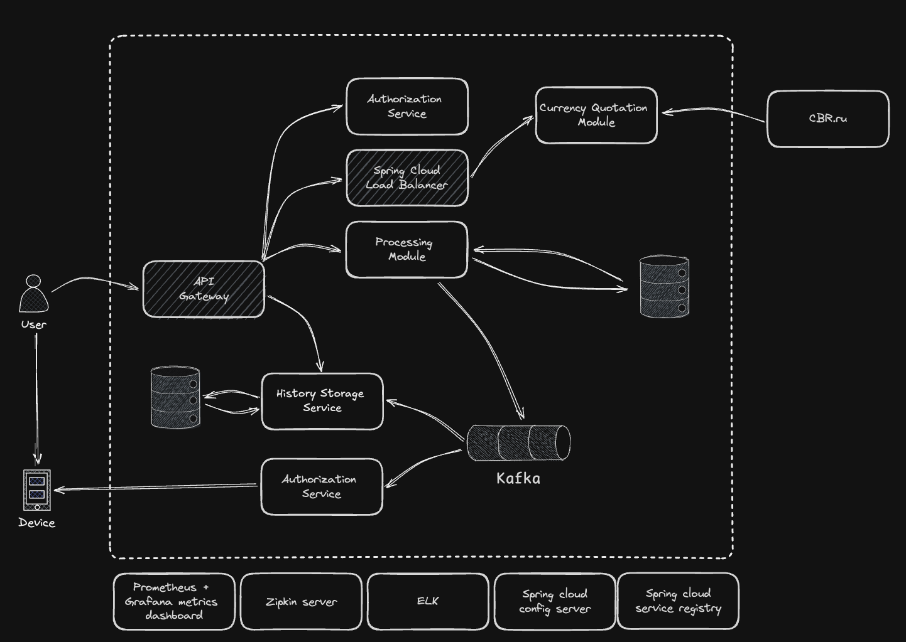

# CurrencyExchanger
Цель данного проекта – разработать серверную часть обменника валют с использования микросервисной архитектуры.

Функциональные требования:
- Котировки валют в режиме реального времени.
- Создание и пополнение счёта.
- Функция обмена валюты переводом между счетами.
- Истории всех операций со счетами.
- Оповещение пользователя через Telegram–бота.
- Разграничение доступа к счетам.

Нефункциональные требования:
- Минимальный простой при работе системы (SLA).
- Возможность горизонтального масштабирования отдельных модулей.
- Мониторинг, журналирование и конфигурирование.
- Минимальная скорость старта и остановки, исключение потери данных.

